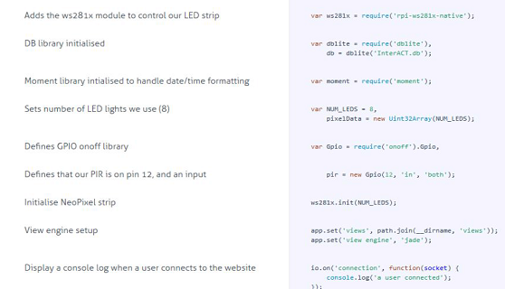

## Portfolio
 Hey! I'm Michael. I'm 26 years old, and I'm passionate about System Administration, Security, and Web Development. I have a wide variety of skills, with a specialisation in web technologies (C# MVC, HTML5 and CSS, a little NodeJS too!), and also Windows Automation using PowerShell. I'm currently exploring the world of Windows AD using Azure, and I have some minimal experience with Linux Systems as well. I fancy myself as an amatuer presenter/public speaker, I have experience in facilitating official training seminars for Microsoft on business/consumer products, I focus on breaking down potentially complex technical concepts for audiences with minimal technical experience.
  
 I have worked for Microsoft Australia for 7 years, with 5 years of retail sales and 2 years of customer-facing support (helpdesk). I'm a (very) amatuer electronics hobbyist, with some experience using Micro-Controllers for basic home automation. You can contact me [Here](mailto:michaelcondon@outlook.com)

---

### Projects 

[PS-Scripts](https://github.com/MichaelCondon/PS-Scripts)

This is the repository where I host all of the PowerShell Scripts I write day to day to automate basic Windows tasks for work and home.

---

[CRM Link]()

I developed a tool using PowerShell to interface with the Dynamics 365 Discovery API to pull data and generate basic graphs using the .NET charting libraries, and save them in a compressed image format for use in email reports.

---

[InterACT](https://github.com/MichaelCondon/IoT-InterACT)

A project I developed during my time at the University of Technology Sydney that utilises a Raspberry Pi, motion sensors, and a string of [Adafruit Neopixels](https://www.adafruit.com/category/168) to dynamically light indoor and outdoor areas for safety.

---
<!-- [Systems Admin Dashboard](http://example.com/)

---

### More Projects

- [Project 1 Title](http://example.com/)
- [Project 2 Title](http://example.com/)
- [Project 3 Title](http://example.com/)
- [Project 4 Title](http://example.com/)
- [Project 5 Title](http://example.com/)

---

---

 -->
